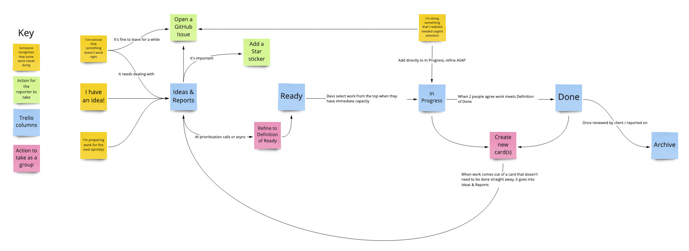

# Delivery Stage

The delivery stage is where we actually do the project. 

Typically, this will comprise:

* Some early work
* One or more focussed periods of development with a larger team
* Some followup work

The nature and balance of each of these will depend on the project. 

All work that anyone does on the project should be reflected on the [Software Development Board](../project-artefacts/software-development-board.md).

### Workflows

Different types of work have different workflows. For transparency, all types of work exist on the same board, but follow different paths

#### Software Development

The workflow for the software is on [Miro](https://miro.com/app/board/o9J_kpMhQ80=/) , and reproduced here:

  

#### Product Management

Product management work goes into Ideas & Reports when we realise that there's a need, and over to Ready when it's clear what needs to be explored. It's In Progress when someone is actively looking to resolve it. It's Done when the exploration is over and answers have been recorded in the appropriate place \(eg [Knowledge Management board](../project-artefacts/knowledge-management-board.md), new software development cards\) 

#### Docs

Documentation work goes into Ideas & Reports when we realise that there's a type of documentation that we should be writing. It goes into Ready when it's clear what the docs should look like and we've got enough information to write them. They're In Progress when someone's working on them, and Done when the docs are live on the Internet.  

